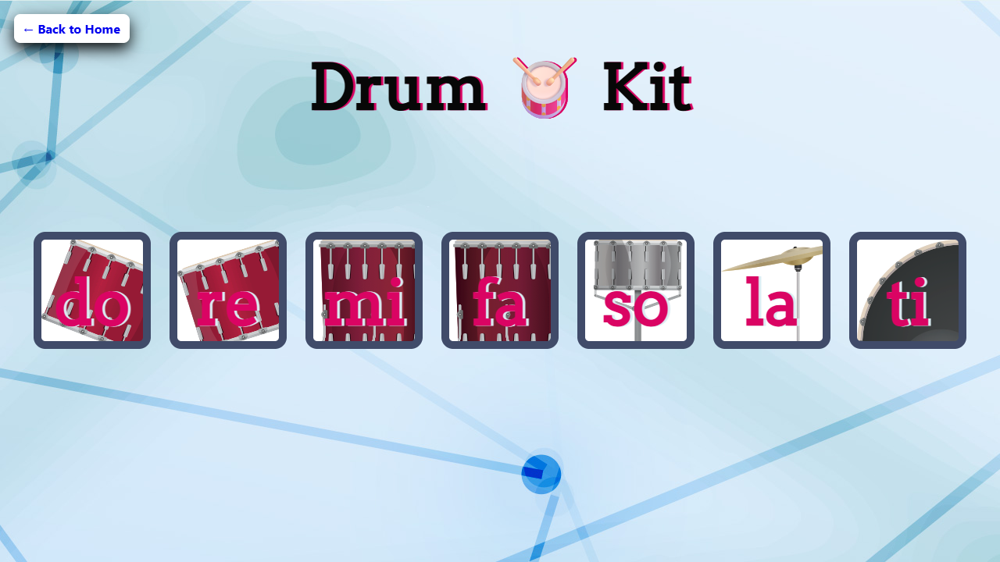

# 🥁 Drum Kit  Game

## 🚀 Overview  

Drum Kit is a responsive web project built using **HTML, CSS, and JavaScript**.  
It allows users to play drum sounds interactively by clicking buttons or pressing keys, simulating a virtual drum set.  

This project is designed as a **frontend-only application** for learning, practice, and portfolio showcase.  

---

# ✨ Features  

- ✅ Interactive drum-playing interface  
- ✅ Play multiple drum sounds (snare, kick, tom, crash, hi-hat, etc.)  
- ✅ Keyboard and click-based sound triggers  
- ✅ Visual feedback animations when sounds are played  
- ✅ Responsive layout for all devices  
- ✅ Mobile-friendly design  

---

# 🛠️ Technologies Used  

| Technology | Purpose |
|------------|----------|
| HTML5 | Structure and markup |
| CSS3 | Styling, responsiveness, animations |
| JavaScript (ES6) | Sound logic, interactions |

---

# 📂 Project Structure  

```text
Drumkit_Game/
│
├── .idea/              # Project settings (IDE-specific)
├── images/             # UI images and assets
├── sounds/             # Drum sound files (snare, kick, tom, crash, hi-hat, etc.)
├── index.html          # Main HTML file
├── styles.css          # Styling and animations
├── index.js            # JavaScript logic for sound triggers
├── preview.png         # Project preview screenshot
└── README.md           # Documentation
```

---

# 🎮 Controls & Interactions  

| Feature | Function |
|----------|-----------|
| Drum Buttons | Play respective drum sound |
| Keyboard Shortcuts | Trigger sounds via keys |
| Visual Feedback | Animations when sound is played |
| Responsive Layout | Optimized for desktop, tablet, and mobile |

---

# 📱 Responsive Design  

This project works smoothly across:  

- 💻 Desktop  
- 🖥️ Laptop  
- 📱 Mobile  
- 📲 Tablet  

---

# ▶️ How to Run  

## 1️⃣ Clone the Repository  

```bash
git clone https://github.com/dhairyagothi/100_days_100_web_project/tree/Main/public/Drumkit_Game.git
```

## 2️⃣ Navigate to Project Folder  

```bash
cd Drumkit_Game
```

## 3️⃣ Open in Browser  

Open `index.html` in your browser.  

---

# 🌐 Demo & Repository  

🔗 Live Demo: [https://dhairyagothi.github.io/100_days_100_web_project/public/Drumkit_Game/index.html](https://dhairyagothi.github.io/100_days_100_web_project/public/Drumkit_Game/index.html)  

🔗 GitHub Repository: [https://github.com/dhairyagothi/100_days_100_web_project/tree/Main/public/Drumkit_Game](https://github.com/dhairyagothi/100_days_100_web_project/tree/Main/public/Drumkit_Game)  

---

## 📸 Screenshots  



---

# 📄 License  

This project is created for **educational, learning, and portfolio purposes**.  

You are free to modify and use this project for personal development and practice.  

---

✨ This README now reflects your **Drum Kit project** with the correct directory structure and features.  

