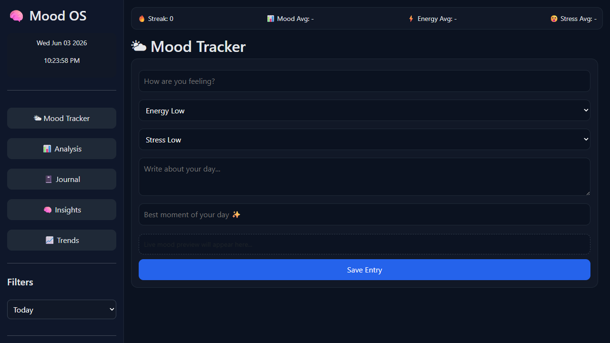

# 🌈 Mood Tracker  

## 🚀 Overview  

Mood Tracker is a responsive web project built using **HTML, CSS, and JavaScript**.  
It allows users to **log and visualize their daily moods** in an interactive interface.  

This project is designed as a **frontend-only application** for learning, practice, and portfolio showcase.  

---

# ✨ Features  

- ✅ Log daily moods with simple UI  
- ✅ Visualize mood trends over time  
- ✅ Responsive layout for all devices  
- ✅ Interactive buttons and animations  
- ✅ Mobile-friendly design  
- ✅ Lightweight and easy to run locally  

---

# 🛠️ Technologies Used  

| Technology | Purpose |
|------------|----------|
| HTML5 | Structure and markup |
| CSS3 | Styling, responsiveness, animations |
| JavaScript (ES6) | Logic, interactions, mood tracking |

---

# 📂 Project Structure  

```text
MoodTracker/
│
├── index.html
├── style.css
├── script.js
└── README.md
```

---

# 🎮 Controls & Interactions  

| Feature | Function |
|----------|-----------|
| Mood Buttons | Select and log your current mood |
| Daily Log | Stores and displays mood entries |
| Visualization | Shows mood trends graphically |
| Responsive Layout | Optimized for desktop, tablet, and mobile |

---

# 📱 Responsive Design  

This project works smoothly across:  

- 💻 Desktop  
- 🖥️ Laptop  
- 📱 Mobile  
- 📲 Tablet  

---

# ▶️ How to Run  

## 1️⃣ Clone the Repository  

```bash
git clone https://github.com/dhairyagothi/100_days_100_web_project/tree/Main/public/Mood%20Tracker.git
```

## 2️⃣ Navigate to Project Folder  

```bash
cd "Mood Tracker"
```

## 3️⃣ Open in Browser  

Open `index.html` in your browser.  

---

# 🌐 Demo & Repository  

🔗 Live Demo: [https://100-days-100-web-project.vercel.app/public/Mood%20Tracker/index.html](https://100-days-100-web-project.vercel.app/public/Mood%20Tracker/index.html)  

🔗 GitHub Repository: [https://github.com/dhairyagothi/100_days_100_web_project/tree/Main/public/Mood%20Tracker](https://github.com/dhairyagothi/100_days_100_web_project/tree/Main/public/Mood%20Tracker)  

---

## 📸 Screenshots  

  

---

# 📄 License  

This project is created for **educational, learning, and portfolio purposes**.  

You are free to modify and use this project for personal development and practice.  

---


