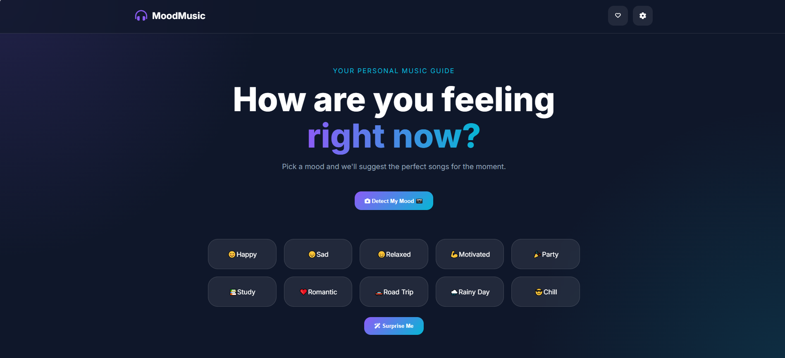

# 🎵 Mood-Based Music Recommender  

## 🚀 Overview  

Mood-Based Music Recommender is a responsive web project built using **HTML, CSS, and JavaScript**.  
It allows users to **pick a mood or detect their mood via camera** and get personalized music recommendations.  

This project emphasizes **privacy** — all face detection runs locally in the browser, with no images or data sent anywhere.  

---

# ✨ Features  

- ✅ Detect mood using camera (face detection runs locally)  
- ✅ Choose from predefined moods (Happy, Sad, Relaxed, Motivated, Party, Study, Romantic, Road Trip, Rainy Day, Chill)  
- ✅ Surprise Me option for random suggestions  
- ✅ Save favorite tracks in **Liked Songs**  
- ✅ Responsive layout for all devices  
- ✅ Dark theme interface for immersive experience  

---

# 🛠️ Technologies Used  

| Technology | Purpose |
|------------|----------|
| HTML5 | Structure and markup |
| CSS3 | Styling, responsiveness, dark theme |
| JavaScript (ES6) | Logic, interactions, mood detection |
| Chart.js | (Optional) Visualization support |
| Bootstrap 5 | Responsive design and UI components |

---

# 📂 Project Structure  

```text
Mood_Based_Music_Recommender/
│
├── index.html
├── style.css
├── script.js
├── settings.html
├── settings.css
├── settings.js
├── preview.PNG
└── README.md
```

---

# 🎮 Controls & Interactions  

| Feature | Function |
|----------|-----------|
| 📷 Detect My Mood | Uses camera to detect mood |
| ✨ Surprise Me | Suggests random songs |
| ❤️ Liked Songs | Save and view favorite tracks |
| Mood Buttons | Select mood manually (Happy, Sad, etc.) |
| Responsive Layout | Optimized for desktop, tablet, and mobile |

---

# 📱 Responsive Design  

This project works smoothly across:  

- 💻 Desktop  
- 🖥️ Laptop  
- 📱 Mobile  
- 📲 Tablet  

---

# ▶️ How to Run  

## 1️⃣ Clone the Repository  

```bash
git clone https://github.com/dhairyagothi/100_days_100_web_project/tree/Main/public/Mood_Based_Music_Recommender.git
```

## 2️⃣ Navigate to Project Folder  

```bash
cd "Mood_Based_Music_Recommender"
```

## 3️⃣ Open in Browser  

Open `index.html` in your browser.  

---

# 🌐 Demo & Repository  

🔗 Live Demo: Mood-Based Music Recommender Demo [(https://100-days-100-web-project.vercel.app/public/Mood_Based_Music_Recommender)](https://100-days-100-web-project.vercel.app/public/Mood_Based_Music_Recommender)  

🔗 GitHub Repository: Mood-Based Music Recommender Repo [(https://github.com/dhairyagothi/100_days_100_web_project/tree/Main/public/Mood_Based_Music_Recommender)](https://github.com/dhairyagothi/100_days_100_web_project/tree/Main/public/Mood_Based_Music_Recommender")  

---

## 📸 Screenshots  

  

---

# 📄 License  

This project is created for **educational, learning, and portfolio purposes**.  

You are free to modify and use this project for personal development and practice.  


