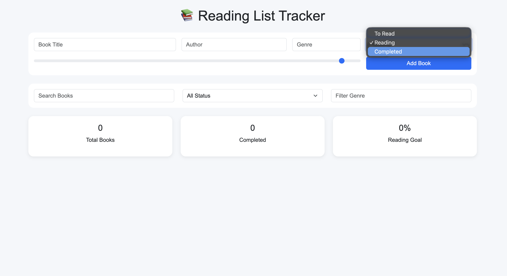

# 📚 Reading List Tracker

A simple and responsive Reading List Tracker built using **HTML, CSS, JavaScript, and Bootstrap**. This project helps users organize their reading journey by managing books they want to read, are currently reading, and have completed.

## 🚀 Features

* ➕ Add new books to your reading list
* ✏️ Edit existing book details
* 🗑️ Delete books from the list
* 📖 Track reading status:

  * To Read
  * Reading
  * Completed
* 📊 Monitor reading progress with progress bars
* 🔍 Search books by title
* 🏷️ Filter books by genre
* 📈 View reading statistics and goal completion percentage
* 💾 LocalStorage support for persistent data
* 📱 Fully responsive design using Bootstrap

---

## 🛠️ Technologies Used

* HTML5
* CSS3
* JavaScript (ES6)
* Bootstrap 5
* LocalStorage API

---

## 📂 Project Structure

```text
Reading_List_Tracker/
│
├── index.html
├── style.css
├── script.js
├── preview.png
└── README.md
```

---

## ⚙️ Installation & Setup

1. Clone the repository:

```bash
git clone https://github.com/dhairyagothi/100_days_100_web_project.git
```

2. Navigate to the project folder:

```bash
cd Reading_List_Tracker
```

3. Open `index.html` in your browser.

No additional dependencies or setup are required.

---

## 🎯 How to Use

1. Enter the book title, author, genre, status, and reading progress.
2. Click the **Add Book** button.
3. View all books in the reading list.
4. Use the search bar to find books quickly.
5. Filter books by status or genre.
6. Update or delete books as needed.
7. Reading statistics update automatically.
8. All data is saved in your browser using LocalStorage.

---

## 📊 Reading Statistics

The application automatically displays:

* Total Books
* Completed Books
* Reading Goal Progress

These statistics help users stay motivated and track their reading habits.

---

## 📸 Preview

Add a screenshot of the application and save it as:

```text
preview.png
```

Example:

```markdown

```

---

## 🔮 Future Enhancements

* ⭐ Book rating system
* 📅 Reading history tracking
* 🔥 Reading streak tracker
* 📚 Book cover image support
* 🌙 Dark mode
* 📤 Import/Export reading lists
* 🤖 Personalized book recommendations

---

## 🤝 Contributing

Contributions, issues, and feature requests are welcome.

Feel free to fork the repository and submit a pull request.

---

## 📜 License

This project is open source and available under the MIT License.

---

### Developed for 100 Days 100 Web Projects

A productivity-focused web application designed to help readers organize, track, and achieve their reading goals.
